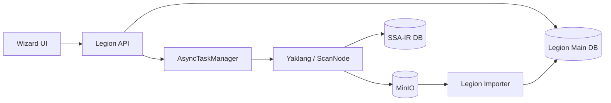

# IRify\_SAST Architecture

## 1. System Goals

IRify\_SAST is a **distributed B/S SaaS scanning platform** built around SSA and SyntaxFlow. It is derived from the IRify client core code (the `yaklang` SSA/SyntaxFlow/ScanNode engine) and serves as a centralized code-security scanning service delivered to customers.

It covers:

- Project configuration and task orchestration
- Distributed ScanNode execution
- SSA IR persistence and reuse
- Streaming scan-result upload, import, and audit
- Frontend workbench and operations pages

### 1.1 Relationship with the IRify\_Client Ecosystem

IRify\_Client (`../IRify_Client/`) is the full desktop-client codebase. IRify\_SAST shares the `yaklang/` core engine with it, but evolves independently in `legion/` (server-side orchestration) and `wizard/` (web frontend).

**Evolution principles:**

- New features (e.g., Memfit AI Agent) are validated and landed in the client first, then migrated / adapted to the SaaS architecture.
- When modifying SaaS-side code, refer to the corresponding client-side implementation to keep core semantics and behavior consistent.
- `yaklang/` is the only shared layer; changes to it must remain compatible with both SaaS and client runtime modes.

## 2. Module Boundaries

### 2.1 `wizard/`

**Responsibilities:**

- Frontend UI
- Project management, scan history, vulnerability management, compilation artifacts, node management
- Calls `legion` APIs via HTTP / SSE

**Constraints:**

- Must not directly depend on `legion` or `yaklang` source code
- Depends only on the API contract

### 2.2 `legion/`

**Responsibilities:**

- Main business backend
- Task orchestration, permissions, primary database, async tasks, scan-result import
- SSA-IR DB control plane (e.g., `ssa_ir_program_series`)

**Constraints:**

- Must not depend on `wizard`
- Interacts with `yaklang/ScanNode` via script arguments, RPC, and MQ

### 2.3 `yaklang/`

**Responsibilities:**

- Scan execution runtime
- SSA compilation, SyntaxFlow scanning, ScanNode MQ / RPC
- Task-level `SSA_DATABASE_RAW` injection and script execution

**Constraints:**

- Handles only computation and streaming output; does not handle business orchestration

### 2.4 `docs/`

**Responsibilities:**

- Design decisions, product specs, execution plans, operational references
- Provides stable entry points for both humans and AI, reducing the chance of "getting lost"

## 3. Core Layers

### 3.1 Control Plane

- `legion` API
- `ssa_tasks`
- `ssa_ir_program_series`
- `AsyncTaskManager`

### 3.2 Compute Plane

- `yaklang` compilation and scan scripts
- `ScanNode` distributed execution

### 3.3 IR Data Plane

- Independent `SSA-IR DB`
- Write during compilation, read-only during scanning
- Future support for `Base + Patch + Overlay`

### 3.4 Result Data Plane

- ScanNode streams results while scanning
- MinIO sharding + manifest
- Legion importer streams data into the main database

## 4. Dependency Directions

- `wizard -> legion`: Allowed, via API / SSE
- `legion -> yaklang`: Allowed, via RPC / scripts / MQ
- `wizard -> yaklang`: **Not allowed**
- `legion -> wizard`: **Not allowed**
- `docs/` is not depended on by business code, but every complex task should conversely depend on documentation and execution plans

## 5. Data and Naming Constraints

- User-visible project names always use `project_name`
- Scan batches are distinguished by `scan_batch`
- `program_name`, `series_key`, and SSA IR IDs are technical identifiers; they should not be used as primary copy except on the "compilation artifacts" page

## 6. Preferred Entry Points for AI Modifications

1. Read `AGENTS.md` first.
2. Then read this file to locate module boundaries.
3. Enter the corresponding directory:
   - UI tasks: `wizard/`
   - API / tasks / data: `legion/`
   - Execution / runtime: `yaklang/`
4. If the feature already has a corresponding implementation in IRify\_Client, first consult the client code under `../IRify_Client/`, then migrate / adapt it to the SaaS architecture.
5. For complex tasks, create an independent plan directory under `docs/exec-plans/active/` first.
